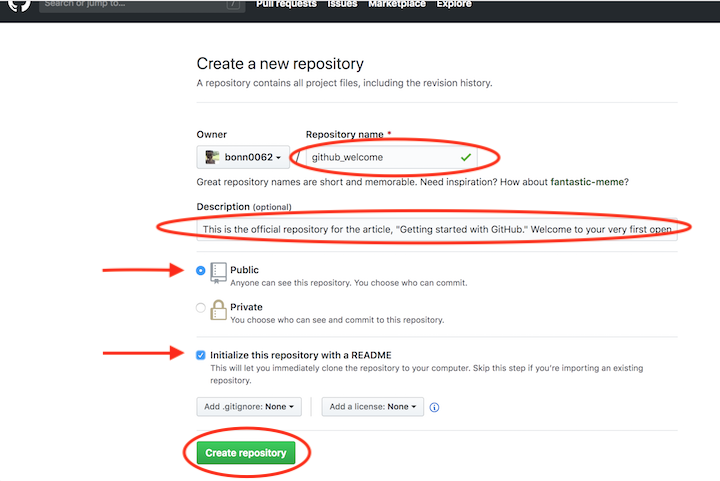

# Основные команды GIT #

## 1 Как задать имя пользователя и адрес электронной почты ##

Имя пользователя нужно, чтобы привязывать коммиты к вашему имени.Задать или изменить имя пользователя можно с помощью команды git config.  *git config --global user.name "* yor name"/ Кроме того, командой git config можно изменять адрес электронной почты, привязанный к вашим коммитам Git: *git config --global user.email "yor email"*

## 2. Инициализация репозитория ##

Создать пустой репозиторий Git или вновь инициализировать существующий можно параметром init. При инициализации он создаст скрытую папку. В ней содержатся все объекты и ссылки, которые Git использует и создаёт в истории работы над проектом. 
*git init*

## 3. Добавление отдельных файлов или всех файлов в область подготовленных файлов ##

Добавить отдельный файл в область подготовленных файлов можно параметром add с указанием имени файла. Просто замените somefile.js на актуальное имя. *git add somefile.js* или все файлы *git add .*

## 4. Проверка статуса репозитория ##

Просмотреть статус нужного репозитория можно по ключевому слову status: его действие распространяется на подготовленные, неподготовленные и неотслеживаемые файлы.
*git status*

## 5.Внесение изменений однострочным сообщением или через редактор ##

*При создании коммита в репозитории можно добавить однострочное сообщение с помощью параметра commit с флагом -m. Само сообщение вводится непосредственно после флага, в кавычках.

*git commit -m "Your short summary about the commit"* 

 ## 6. Просмотр истории коммитов с изменениями ##

 Просматривать изменения, внесённые в репозиторий, можно с помощью параметра log. Он отображает список последних коммитов в порядке выполнения. Кроме того, добавив флаг -p, вы можете подробно изучить изменения, внесённые в каждый файл.

*git log -p*

## 7. Просмотр заданного коммита ##

Просмотреть полный список изменений, внесённых конкретным коммитом, можно с помощью параметра show, указав идентификатор или хеш коммита. Значение хеша уникально для каждого коммита, созданного в вашем репозитории.

*git show 1af17e73721dbe0c40011b82ed4bb1a7dbe3ce29*

Также можно использовать сокращённый хеш.

*git show 1af17e*

## 8. Просмотр изменений до коммита ##

Можно просматривать список изменений, внесённых в репозиторий, используя параметр diff. По умолчанию отображаются только изменения, не подготовленные для фиксации.

*git diff*

Для просмотра подготовленных изменений необходимо добавить флаг --staged.

*git diff --staged*

Также можно указать имя файла как параметр и просмотреть изменения, внесённые только в этот файл.

*git diff somefile.js*

## 9.Удаление отслеживаемых файлов из текущего рабочего дерева ##

Удалять файлы из текущего рабочего дерева можно с помощью параметра rm. При этом файлы удаляются и из индекса.

*git rm dirname/somefile.js*

Можно также использовать маски файлов (например *.js) для удаления всех файлов, соответствующих критерию.

*git rm dirname/*.html*

## 10. Переименование файлов ##

Переименовать файл или папку можно параметром mv. Для него указывается источник source и назначение destination. Источник — реально существующий файл или папка, а назначение — существующая папка.

*git mv dir1/somefile.js dir2*

При выполнении команды файл или папка, указанные как источник, будут перемещены в папку назначения. Индекс будет обновлён соответственно, но изменения нужно записать.

## 11.  Отмена подготовленных и неподготовленных изменений ##

Восстановить файлы рабочего дерева, не подготовленные к коммиту, можно параметром checkout. Для проведения операции требуется указать путь к файлу. Если путь не указан, параметр git checkout изменит указатель HEAD, чтобы задать указанную ветку как текущую.

*git checkout somefile.js*

Восстановить подготовленный файл рабочего дерева можно параметром reset. Потребуется указать путь к файлу, чтобы убрать его из области подготовленных файлов. При этом не будет производиться откат никаких изменений или модификаций — однако файл перейдёт в категорию не подготовленных к коммиту.

git reset HEAD somefile.js

Если нужно выполнить это действие для всех подготовленных файлов, путь к ним указывать не надо.

git reset HEAD

## 12. Изменение последнего коммита ##

Внести изменения в последний коммит можно параметром commit с флагом --amend. Например, вы записали изменения, внесённые в ряд файлов, и поняли, что допустили ошибку в сообщении коммита. В этом случае можете воспользоваться указанной командой, чтобы отредактировать сообщение предыдущего коммита, не изменяя его снимок.

*git commit --amend -m "Updated message for the previous commit"*

Также можно вносить изменения в файлы, отправленные ранее. Например, вы изменили несколько файлов в ряде папок и хотите их записать как единый снимок, но забыли добавить в коммит одну из папок. Чтобы исправить такую ошибку, достаточно подготовить для фиксации остальные файлы и папки и создать коммит с флагами --amend и --no-edit.

*git add dir1*
*git commit*

# Here you forgot to add dir2 to commit, you can execute the
following command to amend the other files and folders.

git add dir2
git commit --amend --no-edit

Флаг --no-edit позволит внести в коммит поправку без изменения сообщения коммита. В этом случае итоговый коммит заменит неполный, а выглядеть это будет так, как будто мы отправили изменения ко всем файлам в нужных папках как единый снимок.

## 13. Откат последнего коммита ##

Откатить последний коммит можно с помощью параметра revert. Создастся новый коммит, содержащий обратные преобразования относительно предыдущего, и добавится к истории текущей ветки.

*git revert HEAD*

▍ Разница между revert и reset

Команда git revert отменяет изменения, записанные только одним коммитом. Она не откатывает проект к более раннему состоянию, удаляя все последующие коммиты, как это делает команда git reset.

У команды revert есть два крупных преимущества по сравнению с reset. Во-первых, она не меняет историю проекта и производит операцию, безопасную для коммитов. Во-вторых, её объектом выступает конкретный коммит, созданный в любой момент истории, а git reset всегда берёт за точку отсчёта текущий коммит. К примеру, если нужно отменить старый коммит с помощью git reset, придётся удалить все коммиты, поданные после целевого, а затем выполнить их повторно. Следовательно, команда git revert — гораздо более удобный и безопасный способ отмены изменений.

## 14. Откат заданного коммита ##

Откатить проект до заданного коммита можно с помощью параметра revert и идентификатора коммита. Создастся новый коммит — копия коммита с предоставленным идентификатором — и добавится к истории текущей ветки.

*git revert 1af17e*

## 15. Создание новой ветки и переход в неё ##

Создать новую ветку можно с помощью параметра branch, указав имя ветки.

*git branch new_branch_name*

Но Git не переключится на неё автоматически. Для автоматического перехода нужно добавить флаг -b и параметр checkout.

*git checkout -b new_branch_name*

## 16. Просмотр списка веток ##

Можно просматривать полный список веток, используя параметр branch. Команда отобразит все ветки, отметит текущую звёздочкой (*) и выделит её цветом.

*git branch*

Также можно вывести список удалённых веток с помощью флага -a.

*git branch -a*

## 17. Удаление ветки ##

Удалить ветку можно параметром branch с добавлением флага -d и указанием имени ветки. Если вы завершили работу над веткой и объединили её с основной, можно её удалить без потери истории. Однако, если выполнить команду удаления до слияния — в результате появится сообщение об ошибке. Этот защитный механизм предотвращает потерю доступа к файлам.

*git branch -d existing_branch_name*

Для принудительного удаления ветки используется флаг -D с заглавной буквой. В этом случае ветка будет удалена независимо от текущего статуса, без предупреждений.

*git branch -D existing_branch_name*

Вышеуказанные команды удаляют только локальную копию ветки. В удалённом репозитории она может сохраниться. Если хотите стереть удалённую ветку, выполните следующую команду:

*git push origin --delete existing_branch_name*

## 18. Слияние двух веток ##

Объединить две ветки можно параметром merge с указанием имени ветки. Команда объединит указанную ветку с основной.

*git merge existing_branch_name*

Если надо выполнить коммит слияния, выполните команду git merge с флагом --no-ff.

*git merge --no-ff existing_branch_name*

Указанная команда объединит заданную ветку с основной и произведёт коммит слияния. Это необходимо для фиксации всех слияний в вашем репозитории.

## 19. Отображение журнала фиксации в виде графика для текущей или всех веток ##

Просмотреть историю коммитов в виде графика для текущей ветки можно с помощью параметра log и флагов --graph --oneline --decorate. Опция --graph выведет график в формате ASCII, отражающий структуру ветвления истории коммитов. В связке с флагами --oneline и --decorate, этот флаг упрощает понимание того, к какой ветке относится каждый коммит.

*git log --graph --oneline --decorate*

Для просмотра истории коммитов по всем веткам используется флаг --all.

*git log --all --graph --oneline --decorate*

## 20. Прекращение слияния при конфликте ##

Прервать слияние в случае конфликта можно параметром merge с флагом --abort. Он позволяет остановить процесс слияния и вернуть состояние, с которого этот процесс был начат.

*git merge --abort*

Также при конфликте слияния можно использовать параметр reset, чтобы восстановить конфликтующие файлы до стабильного состояния.

*git reset*

## 21. Добавление удалённого репозитория ##

Добавить удалённый репозиторий можно параметром remote add, указав shortname и url требуемого репозитория.

*git remote add awesomeapp https://github.com/someurl..*

33 22. Просмотр удалённых URL-адресов 33

Просматривать удалённые URL-адреса можно параметром remote с флагом -v. Этот параметр отображает удалённые подключения к другим репозиториям.

*git remote -v*

Такая команда открывает доступ к интерфейсу управления удалёнными записями, которые хранятся в файле .git/config репозитория.

## 23. Получение дополнительных сведений об удалённом репозитории ##

Получить подробные сведения об удалённом репозитории можно с помощью параметра remote show с указанием имени репозитория — например, origin.

*git remote show origin*

Эта команда отображает список веток, связанных с удалённым репозиторием, а также рабочих станций, подключённых для получения и отправки файлов.

## 24. Отправка изменений в удалённый репозиторий ##

Отправлять изменения в удалённый репозиторий можно параметром push с указанием имени репозитория и ветки.

*git push origin main*

Эта команда передаёт локальные изменения в центральный репозиторий, где с ними могут ознакомиться другие участники проекта.

## 25. Получение изменений из удалённого репозитория ##

Для загрузки изменений из удалённого репозитория используется параметр pull. Он скачивает копию текущей ветки с указанного удалённого репозитория и объединяет её с локальной копией.

*git pull*

Также можно просмотреть подробные сведения о загруженных файлах с помощью флага --verbose.

*git pull --verbose*

## 26. Слияние удалённого репозитория с локальным ##

Слияние удалённого репозитория с локальным выполняется параметром merge с указанием имени удалённого репозитория.

*git merge origin*

## 27. Отправка новой ветки в удалённый репозиторий ##

Передать новую ветку в удалённый репозиторий можно параметром push с флагом -u, указав имя репозитория и имя ветки.

*git push -u origin new_branch* 

## 28. Удаление удалённой ветки ##

Чтобы избавиться от удалённой ветки, используйте параметр push с флагом --delete, указав имя удалённого репозитория и имя ветки.

*git push --delete origin existing_branch*

## 29. Использование перебазирования ##

Для доступа к этой функции используйте параметр rebase с указанием имени ветки. Перебазирование — это процесс объединения или перемещения последовательности коммитов на новый родительский снимок.

*git rebase branch_name*

Эта команда изменит основу ветки с одного коммита на другой, как если бы вы начали ветку с другого коммита. В Git это достигается за счёт создания новых коммитов и применения их к указанному базовому коммиту. Необходимо понимать, что, хотя ветка и выглядит такой же, она состоит из совершенно новых коммитов.
END

# GitHub # инструкция создания репозитория
GitHub — крупнейший веб-сервис для хостинга IT-проектов и их совместной разработки. Веб-сервис основан на системе контроля версий Git и разработан на Ruby on Rails и Erlang компанией GitHub.
## Для начала работы ##
Перейдите на сайт GitHub. Нажмите на значок + в верхнем правом углу, а затем выберите New repository.
Придумайте имя репозитория и добавьте короткое описание.
Решите, будет ли этот репозиторий размещаться в открытом доступе или останется закрытым для просмотра.
Нажмите Initialize this repository with a README для добавления README-файла. Настоятельно рекомендую снабжать все ваши проекты файлом-описанием, ведь README — это первая вещь, на которую люди обращают внимание при просмотре репозитория. К тому же, здесь можно разместить нужную информацию для понимания или запуска проекта.
!
!
При желании можете уже сейчас начинать работать над проектом. Добавляйте файлы, вносите в них изменения и т.д. напрямую с сайта GitHub. Однако конечный результат подобной деятельности может вас немного огорчить.

Вносить изменения в проект можно двумя способами. Вы можете изменять файлы/блокноты на компьютере либо делать это на сайте GitHub.

Допустим, вам захотелось подкорректировать README-файл на сайте GitHub.

Для начала перейдите в ваш репозиторий.
Для выбора файла кликните по его названию (например, кликните по README.md для перехода к файлу-описанию).
В верхнем правом углу вы увидите иконку с карандашом. Нажмите на нее для внесения изменений.
Напишите короткое сообщение, передающее суть изменений (и подробное описание, если сочтете это нужным).
Нажмите кнопку Commit changes.
При желании можете уже сейчас начинать работать над проектом. Добавляйте файлы, вносите в них изменения и т.д. напрямую с сайта GitHub. Однако конечный результат подобной деятельности может вас немного огорчить.

Вносить изменения в проект можно двумя способами. Вы можете изменять файлы/блокноты на компьютере либо делать это на сайте GitHub.

Допустим, вам захотелось подкорректировать README-файл на сайте GitHub.

Для начала перейдите в ваш репозиторий.
Для выбора файла кликните по его названию (например, кликните по README.md для перехода к файлу-описанию).
В верхнем правом углу вы увидите иконку с карандашом. Нажмите на нее для внесения изменений.
Напишите короткое сообщение, передающее суть изменений (и подробное описание, если сочтете это нужным).
Нажмите кнопку Commit changes.
!
!

Для клонирования репозитория на компьютер перейдите в репозиторий на GitHub и нажмите большую зеленую кнопку под названием Clone or download (разумеется, вы можете просто скачать репозиторий и избежать всех заморочек с терминалом. Но я в вас верю, поэтому не будем сдаваться!). Проследите, чтобы появилась надпись Clone with HTTPS. Теперь нажмите на иконку буфера обмена для копирования-вставки (либо выделите ссылку и скопируйте ее).
!
Откройте терминал и перейдите в директорию для копирования репозитория. Например, для перехода на Рабочий стол напечатайте вот это:

cd Desktop
Затем клонируйте туда репозиторий по следующей команде:

git clone <то,_что_вы_только_что_скопировали>
Все просто! Не забудьте изменить информацию в угловых скобках на нужную вам. И удалите сами скобки < >.

*Если вы не очень хорошо ориентируетесь в терминале, то переход по директориям можно осуществлять через команду cd. Например, откройте терминал и напечатайте ls для отображения перечня доступных директорий. Вполне возможно, что в этом списке вы сразу увидите директорию Desktop. Либо напечатайте cd Desktop. Далее выполните команду git clone и склонируйте репозиторий на Рабочий стол.*

*Бывает и так, что вместо перечня расположений, вы видите различные имена пользователей. Тогда до того, как перейти в Desktop, вам потребуется выбрать нужного пользователя через команду cd <пользователь> (замените <пользователь> на нужное вам имя). Затем снова напечатайте ls, чтобы увидеть весь список. И вот теперь, увидев в списке Desktop, смело печатайте cd Desktop. Сейчас уже можно выполнять git clone!*

*Если вдруг в терминале вы захотите «откатиться» на шаг назад, то напишите cd ..*

Новый GitHub-репозиторий, склонированный на рабочий стол, готов! Данная команда создает точную копию репозитория в вашей системе. Здесь вы сможете с ним работать, редактировать, индексировать изменения, создавать коммиты с изменениями и отправлять их на GitHub.

*Совсем не обязательно создавать репозиторий на Рабочем столе. Клонировать можно в любое место на компьютере. Команду git clone можно выполнять и сразу после открытия терминала. Однако, если вы не очень любите копаться в папках на компьютере, то неплохо будет разместить проект на виду, то есть на Рабочем столе…*

Если хотите просто покопаться в каком-то проекте, то вместо клонирования можете сделать форк проекта на GitHub. Для этого нажмите кнопку Fork в верхнем правом углу сайта. Так вы добавите копию этого проекта в свои репозитории и сможете вносить туда любые изменения без вреда для оригинала.
Теперь ваши изменения сохранены в указателе локальной копии проекта. Для отправки изменений на удаленный репозиторий выполните команду:

git push
Тем самым вы отправляете изменения напрямую в репозиторий. Если вы работаете на локальном компьютере и хотите, чтобы коммиты отображались в онлайн, то необходимо своевременно отправлять эти изменения на GitHub по команде git push.

Актуальность версии можно проверить в любое время через команду git status.

Итог: у вас есть свой GitHub репозиторий, вы научились добавлять и изменять в нем файлы.